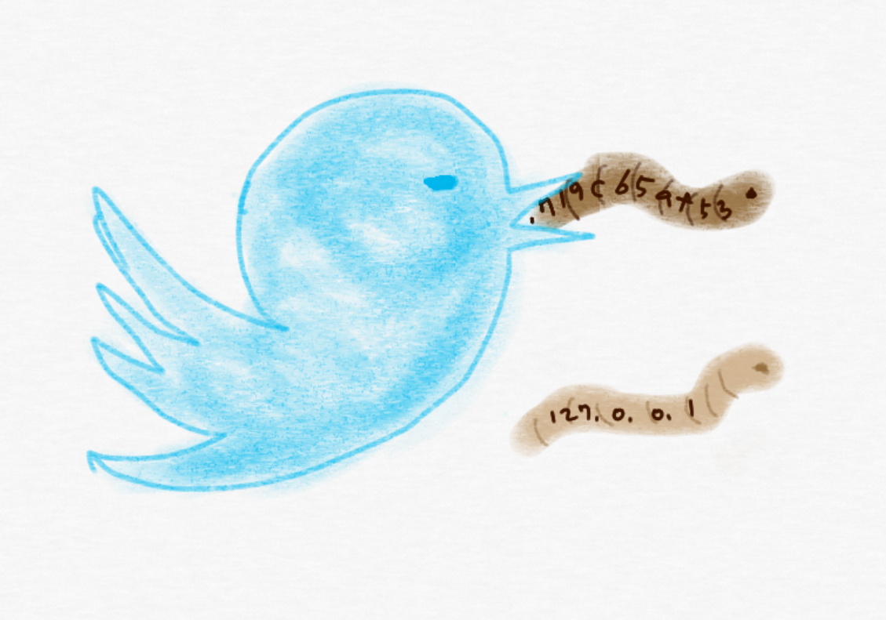

# TwiTi

<p align="center">
    
</p>

TwiTi, a tool for extracting IOCs from tweets, can collect a large number of fresh, accurate IOCs.   
TwiTi does
- classifying whether a tweet contains IOCs or not.
- extracting IOCs from a tweet and also from links mentioned in a tweet.

For more details please refer to our paper,     
"[\#Twiti: Social Listening for Threat Intelligence](https://dl.acm.org/doi/10.1145/3442381.3449797)" (TheWebConf 2021)   
Also, you can find supplementary materials of the paper in [data](data) directory.
### Notice
Due to change of Twitter's API policy, we can not use tweet data freely. You may have to subscribe API access of Twitter to use TwiTi.

## Requirements
### Python
[](https://www.python.org/downloads/release/python-370/)
```bash
pip install -r requirements.txt
```

### NER
TwiTi utilizes NER model for text processing. NER model should be built before run.   
Please refer to [ner/README.md](ner/README.md) for more information.

## Run
Run commands below in ```TwiTi``` directory
### IOC extraction
```bash
python -m ioc_extractor --help
```

### Tweet classification
```bash
python -m classifier --help
```

## Remarks on data license
License may change over time. Almost all the data owners state that they may revise ToS at any time without notice. For example, at the time of our investigation, AlienVault did not provide any legal terms about OTX data usage right in its End-User License Agreement. We instead found the following statement in its website.  
> Most threat data sharing products or services are limited in what they provide or require users to pay extra for what the provider deems as "premium" features. ... OTX alleviates that problem by providing a comprehensive threat intelligence service that’s 100% free, along with multiple methods for your security tools. 

Hence, we interpreted AlienVault OTX as being "available for commercial use". However, its End-User License Agreement has been updated since April 2021 and it now clearly states that 
> OTX is free to end users for non-commercial use. 

This license restriction affects on the amount of IOCs by data use restriction in Section 5.1 of our paper.
